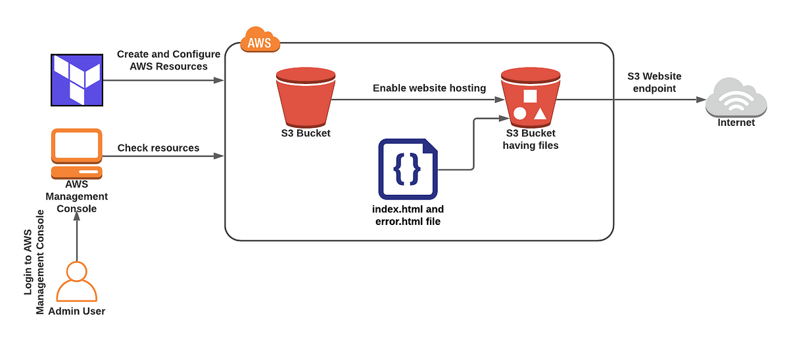

# Terraform Project: Deploy Static Website on S3 Bucket

## Overview

This Terraform project demonstrates how to deploy a static website on an AWS S3 bucket. It covers setting up the S3 bucket, configuring its access control, uploading static files, and enabling static website hosting using S3.




### Resources Configured

The following AWS resources are created by this project:

- **AWS S3 Bucket**: Stores the static website files.
- **AWS S3 Bucket Ownership Controls**: Configures ownership controls for objects stored in the bucket.
- **AWS S3 Bucket Public Access Block**: Manages public access to the S3 bucket and allows access for the website.
- **AWS S3 Bucket ACL**: Sets the access control list (ACL) for the bucket to `public-read` for public access to files.
- **AWS S3 Object**: Uploads the website files (HTML, CSS, JS, images, etc.) from the specified folder.
- **AWS S3 Bucket Website Configuration**: Configures the bucket for static website hosting, specifying the index document (`index.html`).

## Prerequisites

Before using this project, make sure you have:

- **Terraform** installed on your local machine.
- An **AWS Account** with sufficient permissions to create and manage S3 resources.
- **AWS CLI** configured on your machine, or the AWS credentials set using environment variables.

## Project Structure

This project includes the following key files:

- **main.tf**: The main configuration file that defines resources (S3 bucket, ACL, etc.).
- **variables.tf**: Defines input variables for dynamic configuration (e.g., bucket name, folder for website files).
- **terraform.tfvars**: Provides values for the input variables (e.g., bucket name, file path).
- **outputs.tf**: Optional output configuration to display the bucket URL or other details after deployment.

## Configuration

### Input Variables

This project requires two variables:

- **bucketname**: The name of the S3 bucket (this must be globally unique).
- **folder_name**: The local folder containing the website files to upload (HTML, CSS, JS, images, etc.).

Example of `terraform.tfvars`:

```hcl
bucketname = "my-static-website-bucket-2025-01-20"
folder_name = "Applight" 
```
### Steps to Deploy the Static Website
**1. Initialize Terraform:** Initialize the Terraform configuration to download necessary providers and set up the working environment.

  ```bash
  terraform init 
  ```

**2. Review the Plan:** Before applying changes, you can review the Terraform plan, which shows the resources that will be created, modified, or destroyed.

  ```bash
  terraform plan 
  ```

**3. Apply the Configuration:** After reviewing the plan, apply the configuration to create the S3 bucket and upload the website files.

  ```bash
  terraform apply
  ```

### Access the Website

Once the resources provisioned you will have the following output and you can also verify the resources on AWS console.

  ```bash
  Apply complete! Resources: 5 added, 0 changed, 0 destroyed.

Outputs:

s3_website_url = "http://<bucket-name>.s3-website-<region>.amazonaws.com"
  ```

### Cleaning Up

To remove the deployed resources and clean up, run:
```bash
terraform destroy
  ```

### Notes

- The S3 bucket’s ACL is set to `public-read`, meaning all files within the bucket are publicly accessible.
- The S3 Object resource uploads all files from the specified `folder_name` directory and infers the content type based on the file extension.
- The S3 Website Configuration specifies `index.html` as the default document for the website.
- Ensure that your S3 bucket name is `globally` unique.